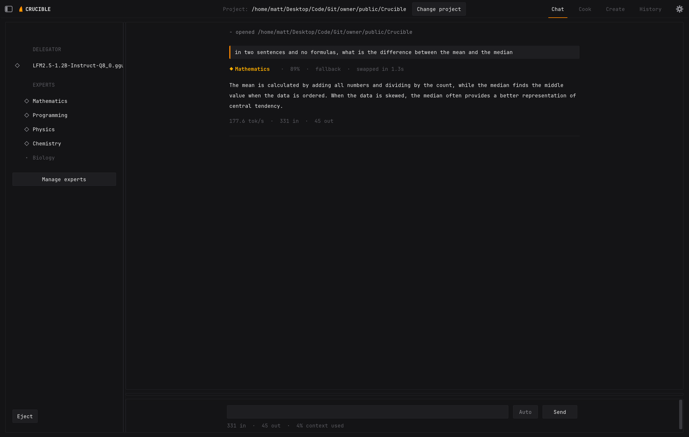
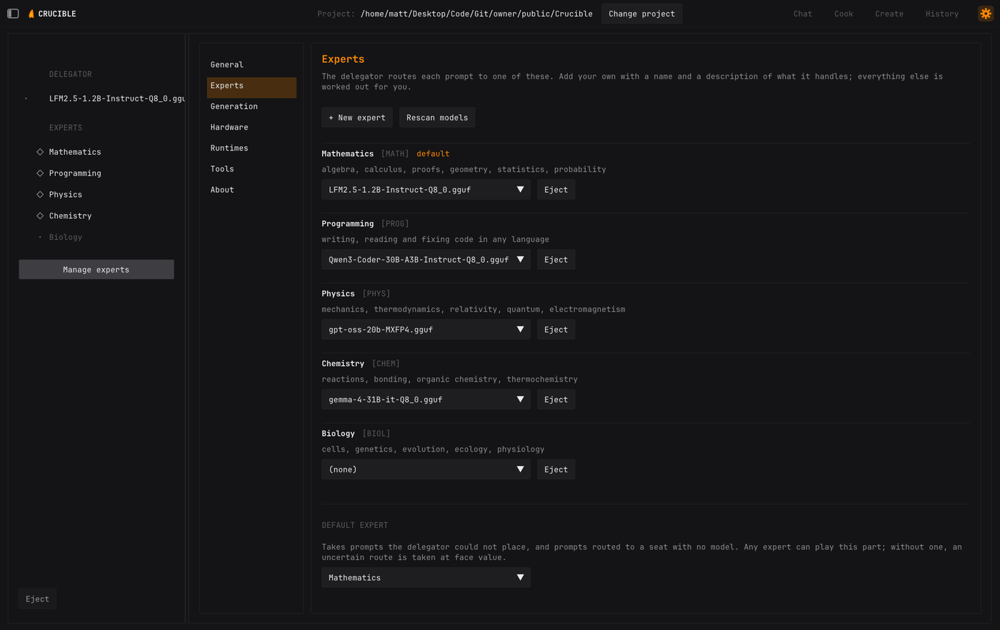
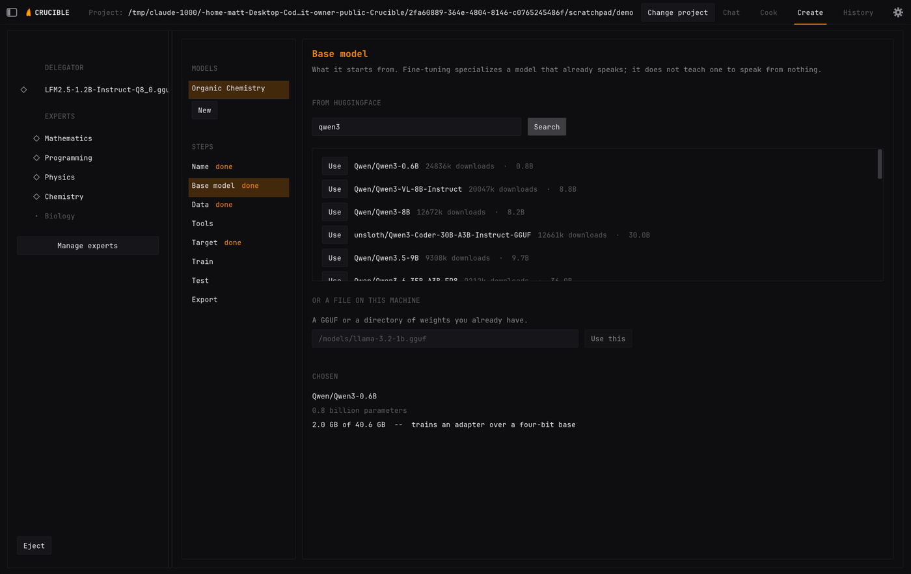
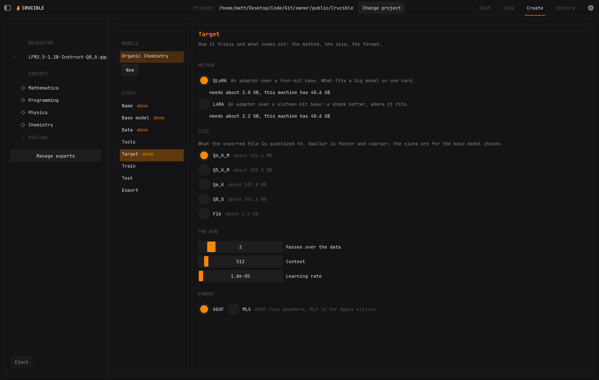
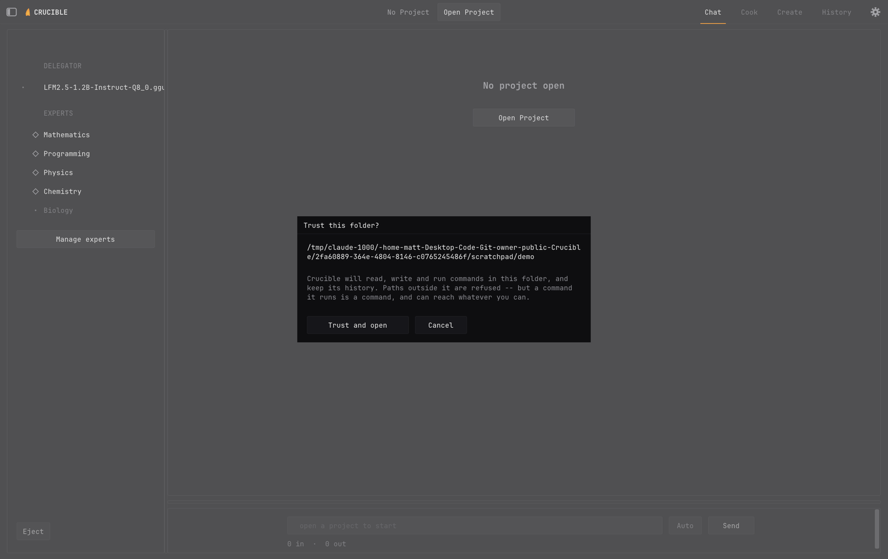
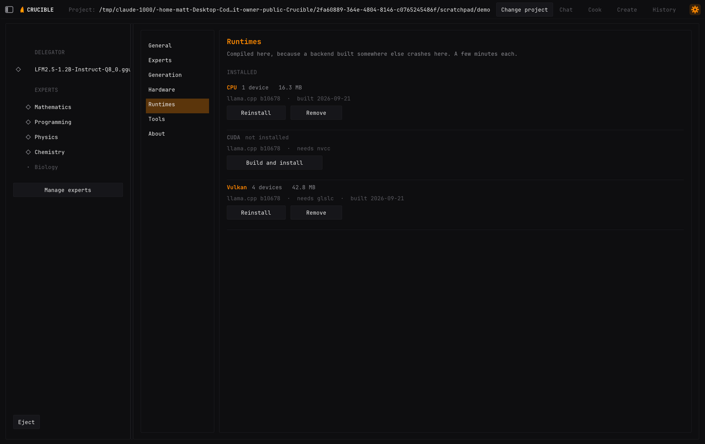
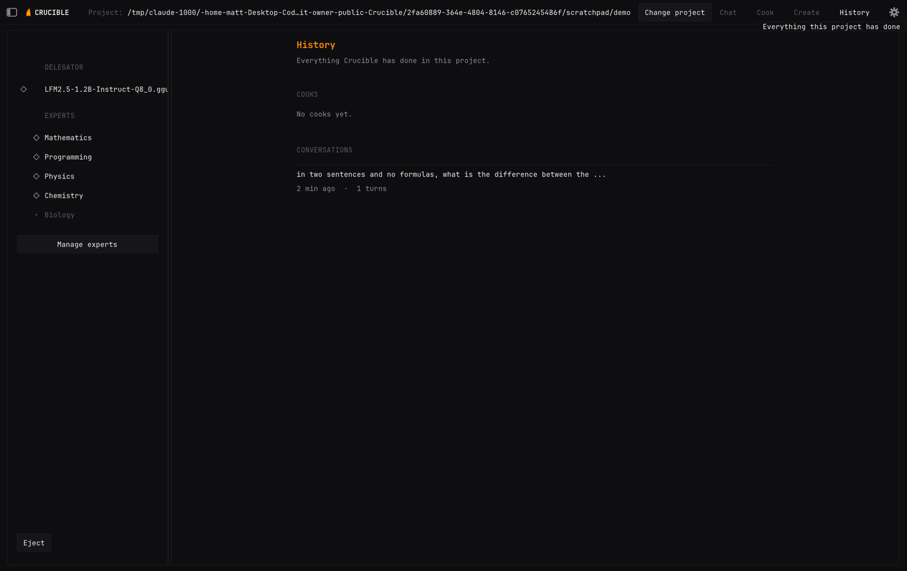

```
   ⠀⠀⠀⠀⠀⠀⢱⣆⠀⠀⠀⠀⠀⠀
   ⠀⠀⠀⠀⠀⠀⠈⣿⣷⡀⠀⠀⠀⠀
   ⠀⠀⠀⠀⠀⠀⢸⣿⣿⣷⣧⠀⠀⠀
   ⠀⠀⠀⠀⡀⢠⣿⡟⣿⣿⣿⡇⠀⠀
   ⠀⠀⠀⠀⣳⣼⣿⡏⢸⣿⣿⣿⢀⠀   C R U C I B L E
   ⠀⠀⠀⣰⣿⣿⡿⠁⢸⣿⣿⡟⣼⡆   a local LLM engine that delegates.
   ⢰⢀⣾⣿⣿⠟⠀⠀⣾⢿⣿⣿⣿⣿
   ⢸⣿⣿⣿⡏⠀⠀⠀⠃⠸⣿⣿⣿⡿
   ⢳⣿⣿⣿⠀⠀⠀⠀⠀⠀⢹⣿⡿⡁
   ⠀⠹⣿⣿⡄⠀⠀⠀⠀⠀⢠⣿⡞⠁
   ⠀⠀⠈⠛⢿⣄⠀⠀⠀⣠⠞⠋⠀⠀
   ⠀⠀⠀⠀⠀⠀⠉⠀⠀⠀⠀⠀⠀⠀
```

**Crucible** runs a roster of small, subject-specific models on your own machine,
routes each prompt to the right one, and lets you build the missing ones
yourself. Ten specialists beat one generalist of the same size, and only one is
in memory at a time.

Everything happens locally. No account, no API key, no telemetry. Two things
reach the network and both can be turned off: web search, which is off by
default, and a once-a-day check for a newer version, which sends nothing but the
request itself.



___
## Install

**Download and double-click** — from the
[releases page](https://github.com/mattsaund/Crucible/releases):

| | | |
|---|---|---|
| macOS | `Crucible-macOS.dmg` | drag Crucible into Applications |
| Windows | `Crucible-Setup.exe` | run it; no administrator prompt |
| Linux | `Crucible-x86_64.AppImage` | `chmod +x` it and run it |

Nothing is code-signed, so Windows shows a SmartScreen warning (More info → Run
anyway) and macOS refuses an unsigned download the first time (right-click →
Open). One-time answers on both.

**Or build from source, in one command:**

```sh
curl -fsSL https://raw.githubusercontent.com/mattsaund/Crucible/main/install.sh | bash
```

```powershell
irm https://raw.githubusercontent.com/mattsaund/Crucible/main/install.ps1 | iex
```

- Builds the program and installs an application entry you can pin to a dock or
  taskbar. Typing `crucible` in a terminal starts the same thing.
- Options: `--prefix DIR`, `--jobs N`, `--check`, `--no-deps`, `-y`, `--uninstall`.
- Run either installer from inside a clone and it builds that clone.
- No models and no compute runtimes are installed — both are picked later from
  the settings screen.

**Updating:** the same command that installed it. Crucible checks GitHub once a
day for a newer release; when there is one, the gear in the corner gets a dot
and **Settings → About** names the version and the line to run. Downloads are
replaced by the newer download from the releases page. Your config, models and
history stay where they are — an update replaces the program and nothing else.
The check is one request for a public version number, it says nothing about the
machine, and the checkbox beside it turns it off.

Versions are `MAJOR.MINOR.PATCH`, tagged `v0.5.0` on GitHub, and the release a
tag builds carries the installers for all three platforms. What changed in each
is in [CHANGELOG.md](CHANGELOG.md).

**Uninstall:** `crucible --uninstall` removes the program, the config, the trust
list, the history and — after naming them and asking — the models. If the binary
is gone or too broken to run, the installers do it instead:

```sh
curl -fsSL https://raw.githubusercontent.com/mattsaund/Crucible/main/install.sh | bash -s -- --uninstall
```

```powershell
& ([scriptblock]::Create((irm https://raw.githubusercontent.com/mattsaund/Crucible/main/install.ps1))) -Uninstall
```

___
## What it does

### Delegate

- A small router model scores every expert on your roster and sends the prompt
  to the best fit, with a confidence you can set a threshold on.
- One model is resident at a time: the router is released, the expert loads,
  answers, and is released in its turn. Peak memory is the larger of the two,
  not the sum.
- Naming an expert that does not exist is impossible — the router scores the
  roster rather than generating a name.



### Cook

- Give it a goal and a time limit; it works in passes — read, change, run,
  judge, go round again — until the goal is met or you stop it.
- Every step is journaled and folds open to the diff or command output it made.
- It can stop to ask you a question, and hand work to a different expert
  mid-cook.

### Create

- Fine-tune your own experts with LoRA or QLoRA — a base model plus a dataset,
  both browsed from Huggingface inside the app or brought from your disk.
- Picks quantization, epochs, context and learning rate, and estimates what
  will fit on your card before the run rather than forty minutes into it.
- Exports GGUF or MLX and seats the result on the roster.
- **In progress:** the recipe, the Huggingface browsing and the fit estimate
  work today; the training run, downloads, test bench and export are being
  built.





### Act on a project

- Trust a folder once and experts can read, write and run things in it — in
  Chat as well as in Cook.
- Every path is resolved inside the project root; absolute paths, `..` and
  symlinks that escape it are refused.
- `RUN` is the exception and is worth being exact about: a command starts in the
  project root and is otherwise a command. Real confinement means a sandbox,
  which is not here yet.
- Auto mode off (the default) shows you each edit before it lands, old file
  beside new. Cook always applies and records what it did.



### Run on your hardware

- Compute runtimes — CUDA, Vulkan, Metal, CPU — are compiled on demand from the
  settings screen, against the same llama.cpp the program was built from.
- Multiple GPUs: `auto`, `even`, `priority` (an order you arrange) or `single`.
- Optional: keep every layer on the GPU, and refuse models that will not fit in
  video memory.



### Keep the work

- History is per project, and reopening a conversation hands the exchanges back
  to the expert rather than starting cold.
- A conversation that outgrows the context window rolls, truncates its middle,
  or stops — your choice — and says so in the transcript when it drops
  anything.



___
## Configuration

Everything is editable from the settings screen: models directory, a model for
each seat, sampling, hardware, runtimes. The file behind it is
`~/.config/crucible/config.json`, and it can be edited by hand.

___
## Build from source

A C++20 compiler, CMake ≥ 3.24, git, and on Linux the OpenGL and X11
development headers. llama.cpp, Dear ImGui, GLFW and nlohmann/json are fetched
and pinned automatically.

```sh
cmake -B build -DCMAKE_BUILD_TYPE=Release
cmake --build build -j$(nproc)
sudo cmake --install build --component crucible
```

Pass `--component crucible`: a plain install would also drop llama.cpp's own
libraries loose into the prefix.

___
## Contributing and AI policy

I am open to AI and agentic coding, but the code written needs to follow
specific guidelines:

1. MUST be human readable, acceptable variable/function names.
2. Easily traceable, following a good program flow.
3. Contributor MUST look at/document code and code changes. You need to
   understand the code that is being written.

Every push is built and tested on Linux, macOS and Windows.

___
## License

MIT — see [LICENSE](LICENSE). Every dependency Crucible links is MIT too, and
[THIRD_PARTY.md](THIRD_PARTY.md) lists them with their pinned versions.

Model weights are covered by none of it. Crucible ships no models and downloads
none; whatever GGUFs you put in your models directory carry their own licenses,
which are between you and whoever trained them.

The software is provided "as is", without warranty of any kind. You are
responsible for what your models read, write and run on your machine.
