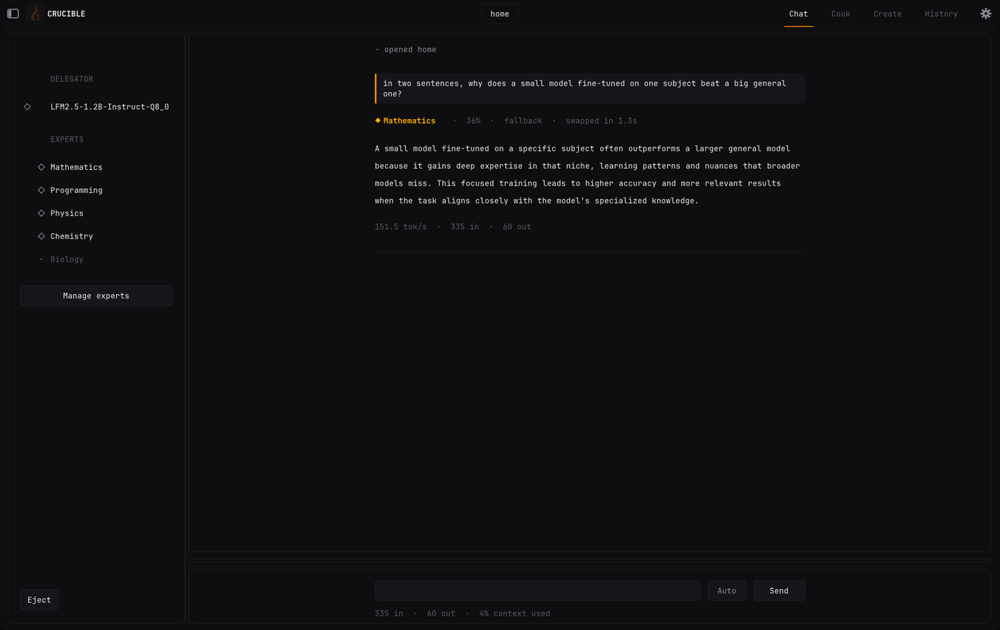
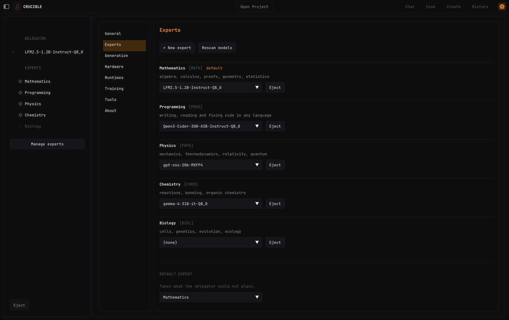
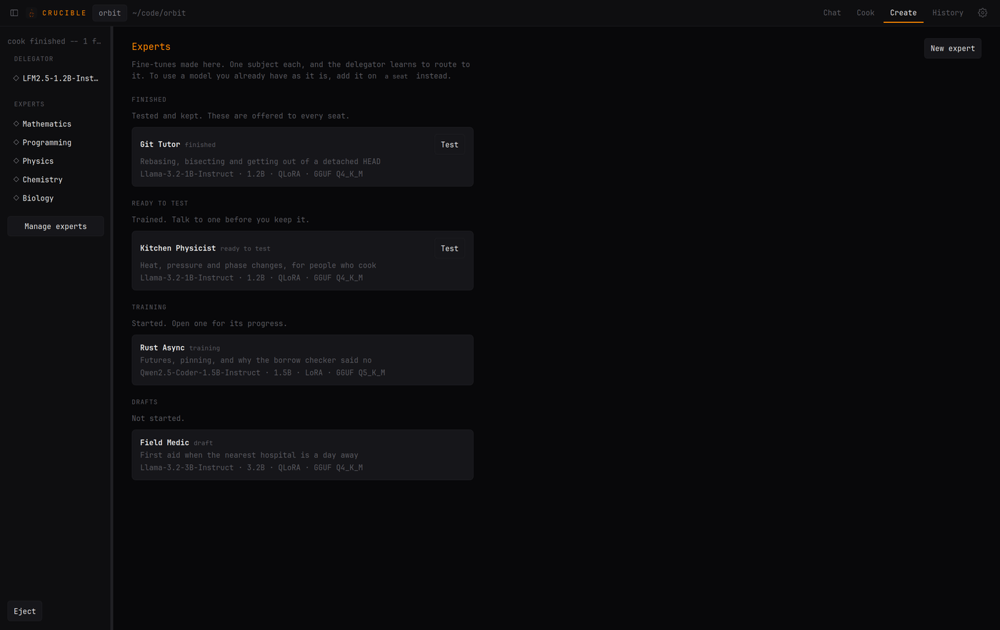
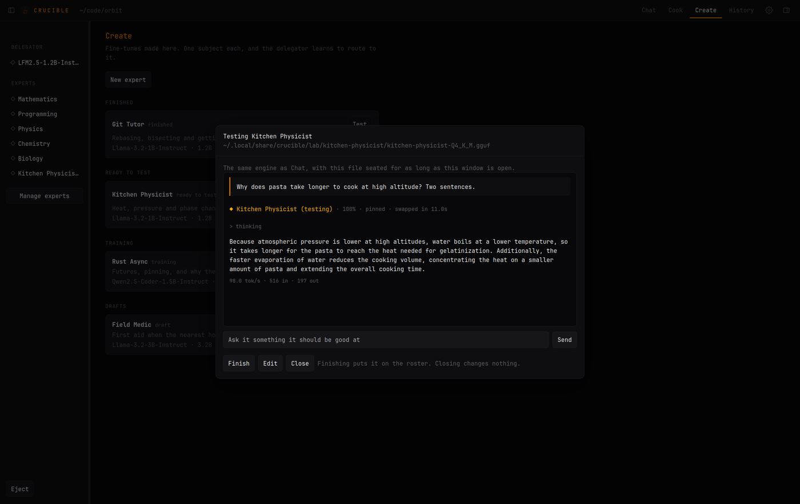
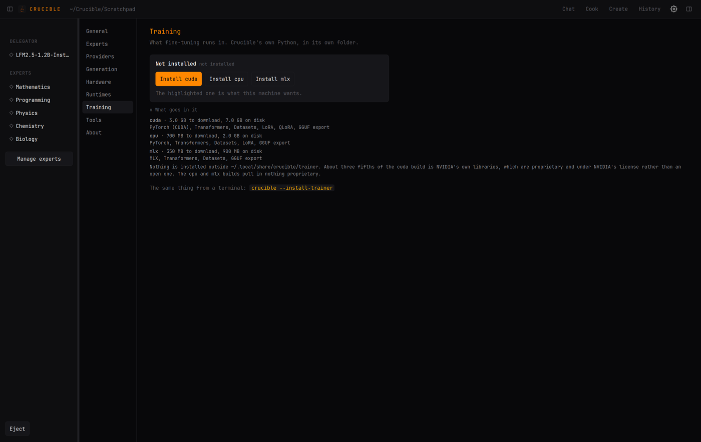
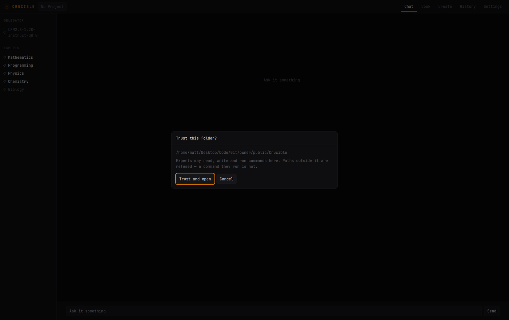
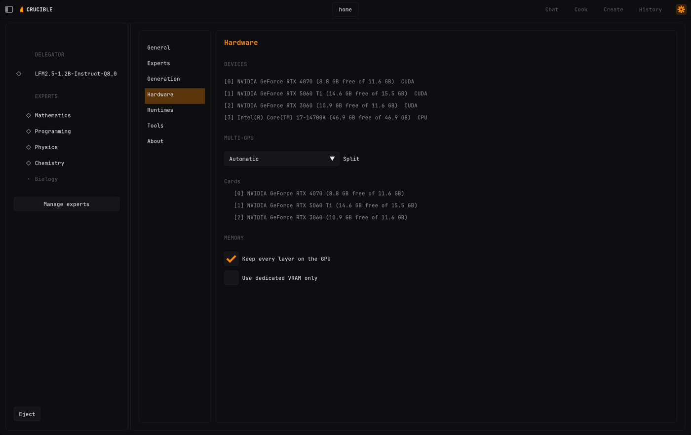
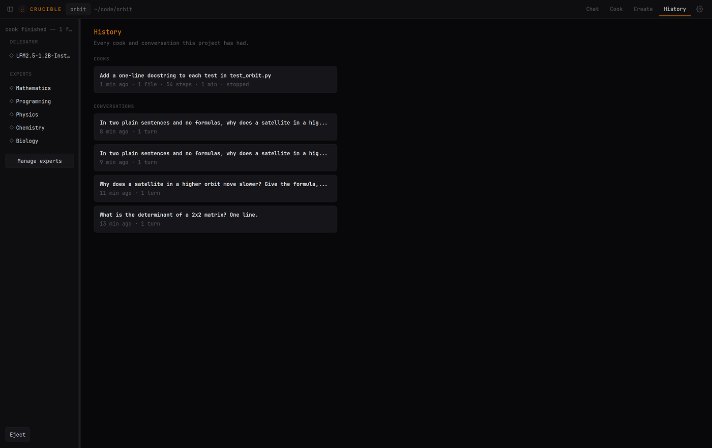

```
   ⠀⠀⠀⠀⠀⠀⢱⣆⠀⠀⠀⠀⠀⠀
   ⠀⠀⠀⠀⠀⠀⠈⣿⣷⡀⠀⠀⠀⠀
   ⠀⠀⠀⠀⠀⠀⢸⣿⣿⣷⣧⠀⠀⠀
   ⠀⠀⠀⠀⡀⢠⣿⡟⣿⣿⣿⡇⠀⠀
   ⠀⠀⠀⠀⣳⣼⣿⡏⢸⣿⣿⣿⢀⠀   C R U C I B L E
   ⠀⠀⠀⣰⣿⣿⡿⠁⢸⣿⣿⡟⣼⡆   a local LLM engine that delegates.
   ⢰⢀⣾⣿⣿⠟⠀⠀⣾⢿⣿⣿⣿⣿
   ⢸⣿⣿⣿⡏⠀⠀⠀⠃⠸⣿⣿⣿⡿
   ⢳⣿⣿⣿⠀⠀⠀⠀⠀⠀⢹⣿⡿⡁
   ⠀⠹⣿⣿⡄⠀⠀⠀⠀⠀⢠⣿⡞⠁
   ⠀⠀⠈⠛⢿⣄⠀⠀⠀⣠⠞⠋⠀⠀
   ⠀⠀⠀⠀⠀⠀⠉⠀⠀⠀⠀⠀⠀⠀
```

**Crucible** runs a roster of small, subject-specific models on your own machine,
routes each prompt to the right one, and lets you build the missing ones
yourself. Ten specialists beat one generalist of the same size, and only one is
in memory at a time.

Website: https://msaunders.dev/crucible/



___
## Install

**Download and double-click** — from the
[releases page](https://github.com/mattsaund/Crucible/releases):

| | | |
|---|---|---|
| macOS | `Crucible-macOS.dmg` | drag Crucible into Applications |
| Windows | `Crucible-Setup.exe` | run it; no administrator prompt |
| Linux | `Crucible-x86_64.AppImage` | `chmod +x` it and run it |

Nothing is signed with a paid certificate, so Windows shows a SmartScreen
warning (More info → Run anyway) and macOS refuses the download the first time:
open Crucible once, then **System Settings → Privacy & Security → Open Anyway**.
One-time answers on both.

**On its first start it fetches what the download does not carry**, in the
order it is needed, with the progress above the empty chat and nothing to
click:

- its own Python (3.12, about 25–70 MB depending on the platform), which
  routing and cooks run on — no Python on your machine is needed or touched;
- the compute runtimes this machine can use: the CPU always, CUDA with
  NVIDIA's libraries where there is an NVIDIA driver, Metal on a Mac, Vulkan
  elsewhere;
- the training environment for Create, built from that Python — a few
  gigabytes with CUDA, and on a Mac also what runs MLX models.

A chat works as soon as Python and a runtime are in. Anything that fails says
why and has **Try again**.

**Or build from source, in one command:**

```sh
curl -fsSL https://raw.githubusercontent.com/mattsaund/Crucible/main/install.sh | bash
```

```powershell
irm https://raw.githubusercontent.com/mattsaund/Crucible/main/install.ps1 | iex
```

- Builds the program and installs an application entry you can pin to a dock or
  taskbar. Typing `crucible` in a terminal starts the same thing.
- It opens on no project: a chat works in a scratch folder of its own under
  `~/Crucible/Scratchpad`, and the top bar shows the folder's path, until you
  open a project from the panel on the right.
- Options: `--prefix DIR`, `--jobs N`, `--check`, `--no-deps`, `--no-trainer`,
  `-y`, `--uninstall`.
- Run either installer from inside a clone and it builds that clone.
- Crucible's own Python and the compute runtimes this machine can use are put
  in place too, so the first start has nothing left to fetch but what you
  skipped. No models are installed.
- **The fine-tuner is set up**: a private Python environment in Crucible's own
  data folder, a few gigabytes, built from Crucible's own Python rather than
  the machine's. It cannot break a system package and `crucible --uninstall`
  takes it with everything else. `--no-trainer` skips it (the window fetches
  it on first start instead); `crucible --install-trainer` adds or repairs it.

**Updating:** the same command that installed it. Crucible checks GitHub once a
day for a newer release; when there is one it says so in the transcript and
**Settings → About** names the version and the line to run. Downloads are
replaced by the newer download from the releases page. Your config, models and
history stay where they are — an update replaces the program and nothing else.
The check is one request for a public version number, it says nothing about the
machine, and the checkbox beside it turns it off.

Versions are `MAJOR.MINOR.PATCH`, tagged `v0.8.1` on GitHub, and the release a
tag builds carries the installers for all three platforms. What changed in each
is in [CHANGELOG.md](CHANGELOG.md).

**Uninstall:** `crucible --uninstall` removes the program, the config, the trust
list, the history, the fine-tuner's Python environment and — after naming them
and asking — the models. If the binary
is gone or too broken to run, the installers do it instead:

```sh
curl -fsSL https://raw.githubusercontent.com/mattsaund/Crucible/main/install.sh | bash -s -- --uninstall
```

```powershell
& ([scriptblock]::Create((irm https://raw.githubusercontent.com/mattsaund/Crucible/main/install.ps1))) -Uninstall
```

___
## What it does

### Delegate

- A small router model scores every expert on your roster and sends the prompt
  to the best fit, with a confidence you can set a threshold on. The deciding
  is done in Python, in a process of its own on Crucible's Python, and the
  model is asked through the core — so how routing works can be changed and
  measured (`crucible-routebench`) without rebuilding anything.
- One model is resident at a time: the router is released, the expert loads,
  answers, and is released in its turn. Peak memory is the larger of the two,
  not the sum.
- Naming an expert that does not exist is impossible — the router scores the
  roster rather than generating a name. It is shown the roster in three
  orders and the answers averaged, because a small model leans towards
  whichever expert it sees first.
- Nothing is loaded until a prompt needs it: opening Crucible costs the card
  nothing. Bring your own models — Crucible downloads none.
- Or skip it: the menu beside the **+** in the box sends every prompt to one
  expert until you change it back, and `/name` does it for one prompt. The
  menu next to it sets how hard a reasoning model thinks; a model with no
  such setting is never sent it.



### Cook

- Give it a goal; it works in passes — read, change, run, judge, go round
  again — improving on the last pass each time, until you stop it. DONE
  closes one piece of the work, not the cook.
- Every step is journaled and folds open to the diff or command output it made.
- It can stop to ask you a question, and hand work to a different expert
  mid-cook.

### Attach

- The **+** at the bottom left of the box, or Ctrl+U, attaches files, photos
  or a whole folder through the platform's own file dialog — to a question or
  to a cook's goal. Or drag them onto the window: it blurs behind an orange
  outline and takes whatever you let go of. They sit in the box as tiles, and
  you keep typing.
- PDFs, Word (`.docx` and `.doc`), Excel, PowerPoint, OpenDocument, RTF, EPUB,
  HTML, Markdown, code, CSV and any other text are read into the prompt above
  what you typed, each under its own name. A folder sends its readable files,
  skipping dependencies, build output and version control.
- Each attachment is cut to what fits the answering expert's context, and the
  prompt says where it was cut.
- Pictures go to a provider's model as pictures, shrunk to what it takes. A
  model on this machine reads text only and is told a picture was attached
  that it cannot see.
- Nothing is converted anywhere but here.

### Create

- The tab is the experts you have made: what each one is for, what it was built
  from, and whether it is a draft, training, ready to test or finished.
- **New expert** is a wizard — a base model and a dataset, browsed from
  Huggingface inside the app or brought from your disk, then quantization,
  epochs, context and learning rate. It estimates what will fit on your card
  before the run rather than forty minutes into it.
- Starting a run closes the wizard and puts the model in the list; clicking it
  shows its specs and its progress. The finished file is written into your
  models folder, so it is chosen for a seat -- or as the delegator -- like any
  other model there.
- Testing opens a window that really runs the candidate. **Finish** keeps it
  and gives it a seat the delegator can route to; **Edit** goes back to the
  fine-tune parameters.
- Training runs on your card, in Crucible's own Python environment — LoRA, or
  QLoRA where there is CUDA. The page shows the step count, the loss curve,
  which card it picked and how long is left, and stopping takes effect within
  a step.
- Which PyTorch gets installed follows the cards that are in the machine. A
  wheel built for older architectures does not run slowly on a newer card, it
  does not run at all — while still reporting that CUDA is available — so the
  environment names any card its torch has no kernels for.
- **In progress:** a run belongs to the window that started it and stops if
  you close Crucible; there is no checkpoint to resume from. Export is GGUF at
  F16 or Q8_0 — the K-quants need `llama-quantize`, which is not built here
  yet, and a run says so rather than quietly giving you something else. A
  model trained elsewhere with unsloth, axolotl or mlx_lm can be attached to a
  recipe instead.







### Act on a project

- Trust a folder once and experts can read, write and run things in it — in
  Chat as well as in Cook.
- Every path is resolved inside the project root; absolute paths, `..` and
  symlinks that escape it are refused.
- `RUN` is the exception and is worth being exact about: a command starts in the
  project root and is otherwise a command. Real confinement means a sandbox,
  which is not here yet.
- Auto off (the default) shows you each edit before it lands, in Chat and in
  Cook alike, and the switch sits beside the box on both screens.



### Run on your hardware

- Compute runtimes — CUDA, Vulkan, Metal, CPU — are installed from the settings
  screen: downloaded where a build is published for your platform, compiled
  here where it is not. Either way against the same llama.cpp the program was
  built from, because a backend built against another one crashes on the first
  tensor.
- GGUF models, and on Apple Silicon **MLX** models too: a folder of
  `.safetensors` is run by MLX's own server, from the Python environment the
  fine-tuner uses, on this machine only. The models folder is read four levels
  deep, so LM Studio's `publisher/model/` layout, a folder of MLX folders and
  Hugging Face's own cache all work as they are.
- A downloaded CUDA backend needs only an NVIDIA driver — no toolkit. The two
  libraries it needs that the driver lacks, NVIDIA's CUDA runtime and cuBLAS,
  are fetched from NVIDIA with it (a few hundred megabytes) unless the machine
  already has them.
- Multiple GPUs: `auto`, `even`, `priority` (an order you arrange) or `single`.
- Optional: keep every layer on the GPU, and refuse models that will not fit in
  video memory.
- A change in Settings → Hardware lets go of whatever it affects, and the next
  prompt loads it the new way.



### Reach further, when you choose to

- A seat does not have to be a file. It can be answered by a provider: Claude
  through Anthropic's API, or anything that speaks the OpenAI one -- OpenAI,
  Gemini, DeepSeek, Moonshot's Kimi, Cloudflare Workers AI, OpenRouter, Groq --
  and equally a llama.cpp, Ollama or LM Studio server on your own network.
- Use one as a specialist, or as the default expert: the large general model
  that catches what the local ones could not place.
- Nothing is sent anywhere until you add a provider and point a seat at it,
  and a seat that leaves the machine is marked as one. A key can be read from
  an environment variable rather than written to the config file.
- The delegator stays local. It is asked for a probability per expert, which
  is not a thing a provider's API will give.

### Keep the work

- History is per project, and reopening a conversation hands the exchanges back
  to the expert rather than starting cold.
- The panel on the right lists recent conversations across every project,
  named for what they are about, and the projects you have opened; choosing
  one opens it and carries on from where it stopped.
- **New chat** needs no project: each one gets a scratch folder of its own
  under `~/Crucible/Scratchpad` for whatever it makes. To work on a folder of
  yours, open it as a project from the same panel.
- The top bar shows the folder the chat works in; click it to open that
  folder in your file manager.
- A conversation that outgrows the context window rolls, truncates its middle,
  or stops — your choice — and says so in the transcript when it drops
  anything.



___
## Configuration

Everything is editable from the settings screen, and every change applies as
it is made: models directory, a model for each seat, providers, sampling,
hardware, runtimes. The file behind it is
`~/.config/crucible/config.json`, and it can be edited by hand.

___
## Build from source

A C++20 compiler, CMake ≥ 3.24, git, and on Linux WebKitGTK's development
files — `libwebkit2gtk-4.1-dev` on Debian and Ubuntu, `webkit2gtk4.1-devel` on
Fedora. macOS and Windows provide their own webview. llama.cpp, webview and
nlohmann/json are fetched and pinned automatically. No Python is needed to build
or to run: Crucible fetches its own on first start, or with
`crucible --install-python`. The tests start the orchestrator, so running them
wants a Python 3.10 or newer on PATH (or named by `CRUCIBLE_PYTHON`).

```sh
cmake -B build -DCMAKE_BUILD_TYPE=Release
cmake --build build -j$(nproc)
sudo cmake --install build --component crucible
```

Pass `--component crucible`: a plain install would also drop llama.cpp's own
libraries loose into the prefix.

___
## Contributing and AI policy

I am open to AI and agentic coding, but the code written needs to follow
specific guidelines:

1. MUST be human readable, acceptable variable/function names.
2. Easily traceable, following a good program flow.
3. Contributor MUST look at/document code and code changes. You need to
   understand the code that is being written.

Every push is built and tested on Linux, macOS and Windows.

___
## License

MIT — see [LICENSE](LICENSE). What is compiled into the binary is listed in
[THIRD_PARTY.md](THIRD_PARTY.md) with pinned versions, and `crucible
--licenses` prints the notices from the program itself. Most of it is MIT;
the JetBrains Mono typeface is under the SIL Open Font License, which is why
the notices travel inside the binary rather than beside it.

Crucible's own Python is not shipped with it either: on first start it fetches
a pinned CPython 3.12 build from the python-build-standalone project, checks
it against the SHA-256 compiled into Crucible, and unpacks it into its data
folder. CPython is under the PSF License; THIRD_PARTY.md has the rest.

The fine-tuner is separate and is not shipped with Crucible: pip fetches it
onto your machine when you ask for it. It is mostly Apache-2.0, BSD and MIT,
and on an NVIDIA machine PyTorch brings NVIDIA's CUDA libraries, which are
proprietary. THIRD_PARTY.md names them. `--no-trainer` declines the whole
thing, and the CPU and Apple Silicon builds pull in nothing proprietary.

Model weights are covered by none of it. Crucible ships no models and downloads
none; whatever GGUFs you put in your models directory carry their own licenses,
which are between you and whoever trained them.

The software is provided "as is", without warranty of any kind. You are
responsible for what your models read, write and run on your machine.
