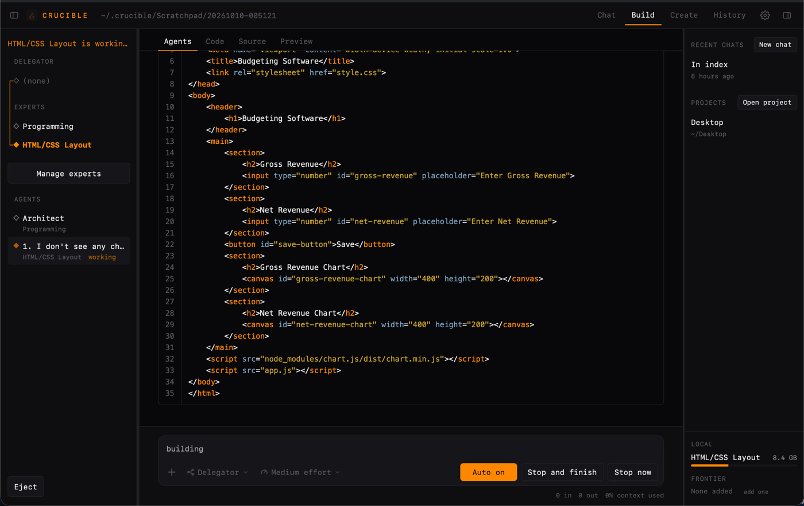
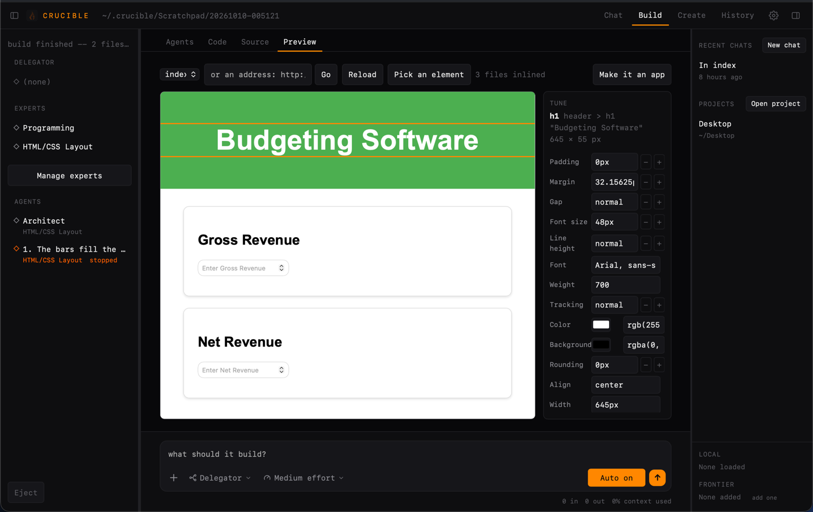

```
   ⠀⠀⠀⠀⠀⠀⢱⣆⠀⠀⠀⠀⠀⠀
   ⠀⠀⠀⠀⠀⠀⠈⣿⣷⡀⠀⠀⠀⠀
   ⠀⠀⠀⠀⠀⠀⢸⣿⣿⣷⣧⠀⠀⠀
   ⠀⠀⠀⠀⡀⢠⣿⡟⣿⣿⣿⡇⠀⠀
   ⠀⠀⠀⠀⣳⣼⣿⡏⢸⣿⣿⣿⢀⠀   C R U C I B L E
   ⠀⠀⠀⣰⣿⣿⡿⠁⢸⣿⣿⡟⣼⡆   a local LLM engine that delegates.
   ⢰⢀⣾⣿⣿⠟⠀⠀⣾⢿⣿⣿⣿⣿
   ⢸⣿⣿⣿⡏⠀⠀⠀⠃⠸⣿⣿⣿⡿
   ⢳⣿⣿⣿⠀⠀⠀⠀⠀⠀⢹⣿⡿⡁
   ⠀⠹⣿⣿⡄⠀⠀⠀⠀⠀⢠⣿⡞⠁
   ⠀⠀⠈⠛⢿⣄⠀⠀⠀⣠⠞⠋⠀⠀
   ⠀⠀⠀⠀⠀⠀⠉⠀⠀⠀⠀⠀⠀⠀
```

**Crucible** builds software from a sentence. Say what you need; an architect
plans it, agents build it, you watch it take shape, tune it, and keep it as a
program of its own. Frontier models do the heavy lifting, local models the
rest, side by side. You bring the idea, the design and the vision.

It is also a local LLM workshop: a roster of small expert models, a delegator
that routes each prompt to the right one, and a fine-tuner to make more.

Website: https://msaunders.dev/crucible/



___
## Install

From the [releases page](https://github.com/mattsaund/Crucible/releases):

| | | |
|---|---|---|
| macOS | `Crucible-macOS.dmg` | drag into Applications |
| Windows | `Crucible-Setup.exe` | run it, no administrator needed |
| Linux | `Crucible-x86_64.AppImage` | `chmod +x`, run it |

Not signed with a paid certificate. Windows: **More info → Run anyway**. macOS:
open it once, then **System Settings → Privacy & Security → Open Anyway**.

**The first start fetches the rest**, with progress shown and nothing to click:

- Crucible's own Python (no system Python needed or touched)
- the compute runtimes the machine can use: CPU, CUDA, Metal, Vulkan
- the programs agents use: GitHub's CLI, Node.js, a headless browser, Git on
  Windows, a text reader for pictures on Linux
- with no model at all, an open coding model sized to the machine (Qwen,
  Apache-2.0), seated as **Programming**
- the fine-tuner's environment

**Or build from source:**

```sh
curl -fsSL https://raw.githubusercontent.com/mattsaund/Crucible/main/install.sh | bash
```

```powershell
irm https://raw.githubusercontent.com/mattsaund/Crucible/main/install.ps1 | iex
```

Options: `--prefix DIR`, `--jobs N`, `--check`, `--no-deps`, `--no-trainer`,
`-y`, `--uninstall`. Run from inside a clone, it builds that clone.

**Updating:** run the installer again, or download the new release. Crucible
checks GitHub once a day and says when there is one (Settings → About turns it
off). Config, models and history are kept. Versions are tagged `v0.8.9`; what
changed is in [CHANGELOG.md](CHANGELOG.md).

**Uninstall:** `crucible --uninstall`. It asks before deleting models. If the
program will not run:

```sh
curl -fsSL https://raw.githubusercontent.com/mattsaund/Crucible/main/install.sh | bash -s -- --uninstall
```

```powershell
& ([scriptblock]::Create((irm https://raw.githubusercontent.com/mattsaund/Crucible/main/install.ps1))) -Uninstall
```

___
## What it does

### Build

- Type a directive in **Build**: "a budgeting app that charts my gross and net
  revenue". The architect writes a plan; type *go*, or what to change.
- Each task goes to the agent that fits it. When nobody on the roster fits, the
  build adds one, and keeps it.
- Agents work side by side: a task starts when the ones before it are done and
  nothing running touches its files.
- **Frontier and local together.** Large tasks go to a provider's model, small
  ones to a model on this machine.
- The **agents** are listed under the experts in the side menu. Click one to see
  its task, its steps and its code.
- Each finished task is committed. A check runs at the end; the architect writes
  up what was built.
- **A change is a sentence.** "Make the button blue" is one task, made and shown.
- The chat stays open while a build runs. Each has its own Stop.



### Preview, tune, ship

- **Preview** shows the page being built and reloads as agents write it.
- **Pick an element**, then nudge padding, margin, fonts, colors and more.
  **Apply to source** writes the change into the stylesheet.
- **Make it an app** packages the page as a program: Applications on a Mac,
  the Start menu on Windows, the applications menu on Linux. It runs without
  Crucible and keeps its own data.
- **Code** is the project's files, highlighted, editable.
- **Source** is git: changes, diffs, commits, pull, push, history, CI runs.
  **Publish to GitHub** and **Ship** a release with `gh`.

### Delegate

- A small router model sends each prompt to the expert that fits, with a
  confidence threshold. It scores the roster, so it cannot name an expert that
  does not exist.
- A model is in memory only while something uses it. Several stay loaded when
  memory allows; one in use is never freed.
- Pin a prompt to one expert from the box, or with `/name`.


### Models

- GGUF everywhere, MLX on Apple Silicon. Models folder read four levels deep,
  so LM Studio and Hugging Face layouts work as they are.
- Local models that see pictures work when their `mmproj` projector sits beside
  them.
- **Providers**: Anthropic, and anything that speaks the OpenAI API: OpenAI,
  Gemini, DeepSeek, Kimi, OpenRouter, Groq, or a server on your network.
  Nothing leaves the machine until you add one and point a seat at it.
- The corner of the right-hand panel shows the local models in memory, and the
  frontier model in use: tokens, cost at list prices, rate limits, context.

### Tools

Every model, local or not, gets the same tools in a trusted folder:

- **Files:** LIST, READ (PDF, Word, sheets, pictures too), FIND, WRITE, EDIT
- **Commands:** RUN in any shell, PYTHON, GIT, GH, and START, LOGS, STOP for
  servers
- **Web:** SEARCH (DuckDuckGo, no key) and FETCH in a headless browser
- **RENDER** an HTML page or SVG to PDF or PNG
- **TOOL** calls any MCP server added in Settings
- **This computer** (off by default): SCREENSHOT, CLICK, MOVE, TYPE, KEY, SCROLL
- Edits wait for your OK unless Auto is on. RUN is not a sandbox.


### Attach

- **+**, Ctrl+U, or drop files on the window: documents, code, pictures,
  folders.
- PDFs, Office files, EPUB and text are read into the prompt. Pictures go to
  models that see; others get the words in them (Vision on a Mac, Windows OCR,
  a reader on Linux).

### Create

- Make an expert: pick a base model and data, train it on your card (LoRA, or
  QLoRA with CUDA), test it, keep it.
- Builds keep what frontier models did as data to teach local ones.


### Hardware

- Runtimes (CPU, CUDA, Metal, Vulkan) install from Settings, downloaded or
  compiled. A downloaded CUDA runtime needs only the NVIDIA driver.
- Several GPUs: auto, even, priority or single.


### History

- History is per project, and a reopened chat carries on where it stopped.
- A chat with no project gets a folder of its own in `~/.crucible/Scratchpad`
  (hidden). The right-hand panel lists recent chats and projects.


___
## Configuration

Everything is in Settings and applies at once. The file is
`~/.config/crucible/config.json` (Windows: `%APPDATA%\crucible\config.json`).

Ctrl+1 to 4: Chat, Build, Create, History. Ctrl+, Settings. Ctrl+U attach.

___
## Build from source

C++20, CMake 3.24+, git, and on Linux WebKitGTK (`libwebkit2gtk-4.1-dev` on
Debian and Ubuntu, `webkit2gtk4.1-devel` on Fedora). Dependencies are fetched
and pinned. The tests want Python 3.10+ on PATH (or `CRUCIBLE_PYTHON`).

```sh
cmake -B build -DCMAKE_BUILD_TYPE=Release
cmake --build build -j$(nproc)
sudo cmake --install build --component crucible
```

___
## Contributing and AI policy

I am open to AI and agentic coding, but the code written needs to follow
specific guidelines:

1. MUST be human readable, acceptable variable/function names.
2. Easily traceable, following a good program flow.
3. Contributor MUST look at/document code and code changes. You need to
   understand the code that is being written.

Every push is built and tested on Linux, macOS and Windows. How to test a
change or a release: [docs/testing](docs/testing/README.md).

___
## License

MIT, see [LICENSE](LICENSE). What is compiled in is listed in
[THIRD_PARTY.md](THIRD_PARTY.md); `crucible --licenses` prints the notices.

Fetched, not shipped: Crucible's Python (PSF License), the fine-tuner (mostly
Apache-2.0, BSD and MIT; NVIDIA's CUDA libraries on NVIDIA machines are
proprietary), the agents' programs, and the starter model (Apache-2.0). Model
weights carry their own licenses.

Provided "as is", without warranty. You are responsible for what your models
read, write and run.
